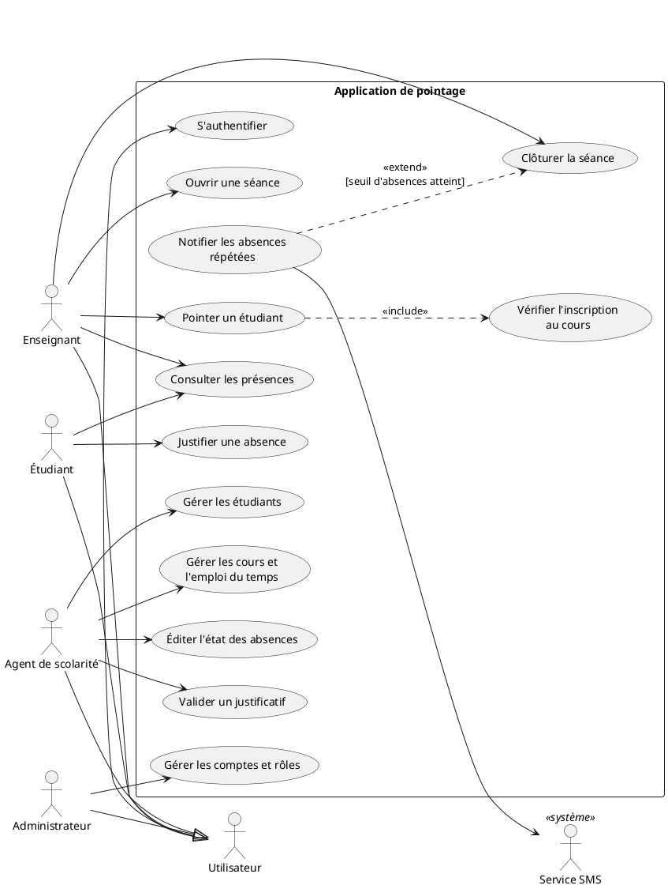
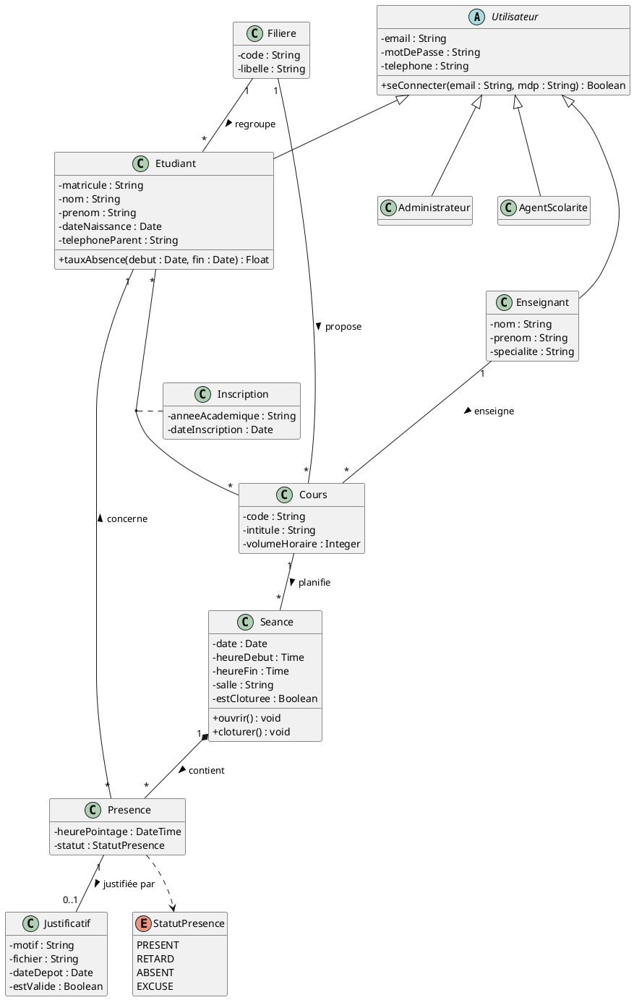
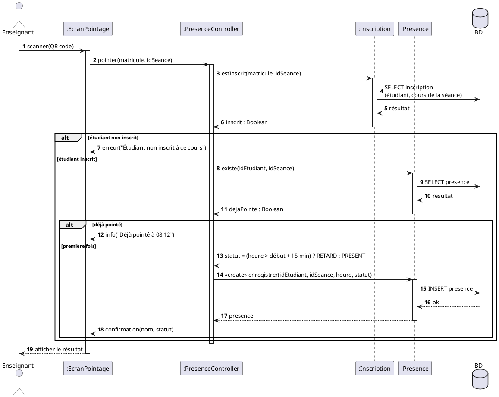
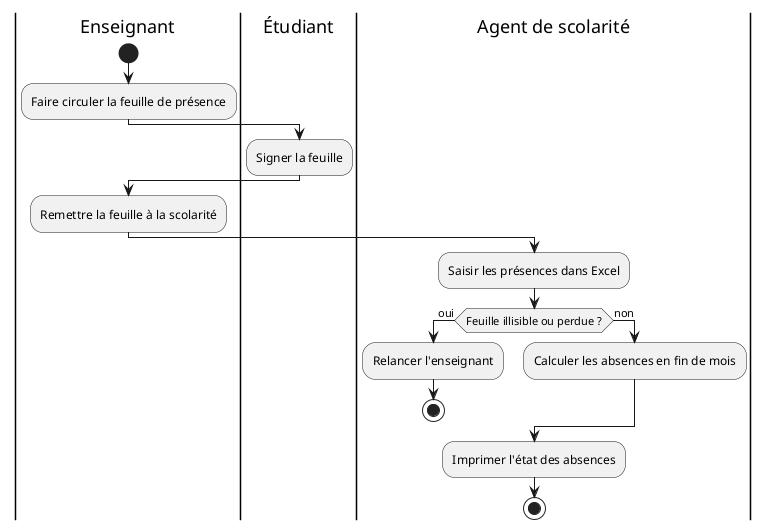
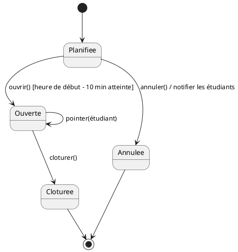
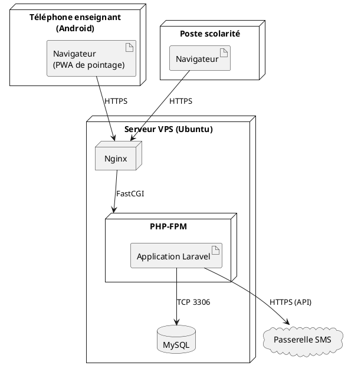

# Exemple complet : application de pointage des étudiants

Sujet tiré du guide : *Réalisation d'une application de pointage et de gestion des étudiants : cas d'un établissement d'enseignement supérieur*. Les diagrammes sont en **PlantUML** : copier chaque bloc dans plantuml.com, l'extension PlantUML de VS Code ou un fichier `.puml`, puis exporter en PNG/SVG.

Rendus PNG (PlantUML) déjà générés dans `uml-exemple/` : `1-cas-utilisation.png`, `2-classes.png`, `3-sequence-pointer.png`, `4-activite-existant.png`, `5-etats-seance.png`, `6-deploiement.png`.

Hypothèses de l'exemple (à remplacer par celles du vrai projet) : application web Laravel pour l'administration et les enseignants, pointage par scan du QR code de la carte étudiant depuis le téléphone de l'enseignant, notification SMS aux parents en cas d'absences répétées.

---

## 1. Acteurs et besoins (étapes 1 et 2)

| Acteur | Besoins (verbe + complément) |
|---|---|
| Enseignant | Ouvrir une séance ; pointer un étudiant ; clôturer la séance ; consulter les présences de ses cours |
| Étudiant | Consulter ses présences et absences ; justifier une absence |
| Agent de scolarité | Gérer les étudiants ; gérer les cours et l'emploi du temps ; valider les justificatifs ; éditer les états d'absences |
| Administrateur | Gérer les comptes et les rôles |
| Service SMS (système externe) | Recevoir les alertes d'absences à envoyer |

## 2. Diagramme de cas d'utilisation



**Commentaire à reprendre dans le mémoire (à adapter) :**
> La figure 2.1 présente les cinq acteurs du système. Les quatre acteurs humains héritent de l'acteur « Utilisateur » : ils doivent tous s'authentifier. Le pointage **inclut** toujours la vérification de l'inscription de l'étudiant au cours, sans laquelle une présence ne peut pas être enregistrée. La notification des absences **étend** la clôture de séance : elle n'a lieu que si le seuil d'absences fixé par la scolarité est atteint, et elle est transmise au service SMS, système externe.

## 3. Description textuelle du cas principal
Voir le modèle « Pointer un étudiant » dans `references/uml.md` §4.4. Il fournit les classes candidates (soulignées ici) : *enseignant, séance, étudiant, cours, inscription, présence, heure, statut (retard)*.

## 4. Diagramme de classes



**Points à savoir expliquer :**
- `Inscription` est une **classe d'association** : la date et l'année d'inscription n'appartiennent ni à l'étudiant seul ni au cours seul.
- `Seance *-- Presence` est une **composition** : une présence n'a pas de sens sans sa séance ; supprimer une séance supprime ses présences.
- `Presence "1" -- "0..1" Justificatif` : une absence peut avoir au plus un justificatif.
- `tauxAbsence()` est une **méthode** (valeur calculée), pas un attribut stocké.
- Les **clés étrangères n'apparaissent pas** : les liens sont portés par les associations.

## 5. Diagramme de séquence : « Pointer un étudiant »



**Commentaire type :** le scénario suit l'architecture MVC de l'application. Le contrôleur vérifie d'abord l'inscription (cas inclus « Vérifier l'inscription »), puis l'absence de doublon. Le statut « retard » applique la règle de gestion des 15 minutes. Les deux cas d'erreur du scénario alternatif apparaissent dans les fragments `alt`.

## 6. Diagramme d'activité : processus actuel (analyse de l'existant)



À placer en **analyse de l'existant** : les couloirs montrent les manipulations manuelles et les points de perte. Un second diagramme d'activité du **processus cible** fait ressortir ce que l'application supprime (circulation de la feuille, double saisie).

## 7. Diagramme d'états : « Séance »



Justifie le champ `estCloturee` (ou un champ `statut`) en base, et la règle « on ne pointe pas une séance clôturée ».

## 8. Diagramme de déploiement



## 9. Passage au modèle relationnel (MLD)

```
filiere(id, code, libelle)
utilisateur(id, type, email, mot_de_passe, telephone)        -- héritage : table unique + type
etudiant(id, #utilisateur_id, #filiere_id, matricule, nom, prenom, date_naissance, telephone_parent)
enseignant(id, #utilisateur_id, nom, prenom, specialite)
cours(id, #filiere_id, #enseignant_id, code, intitule, volume_horaire)
inscription(#etudiant_id, #cours_id, annee_academique, date_inscription)   -- PK (etudiant_id, cours_id, annee_academique)
seance(id, #cours_id, date, heure_debut, heure_fin, salle, est_cloturee)
presence(id, #seance_id, #etudiant_id, heure_pointage, statut)              -- UNIQUE (seance_id, etudiant_id) ; ON DELETE CASCADE sur seance_id
justificatif(id, #presence_id UNIQUE, motif, fichier, date_depot, est_valide)
```

Traces des règles du §9 de `references/uml.md` :
- `Cours "1" — "*" Seance` → `seance.cours_id` ;
- `Etudiant "*" — "*" Cours` + classe d'association → table `inscription` ;
- composition `Seance *-- Presence` → `ON DELETE CASCADE` ;
- `0..1` vers `Justificatif` → `justificatif.presence_id UNIQUE` ;
- règle « pas de double pointage » → contrainte `UNIQUE (seance_id, etudiant_id)`.

**Variante Merise (MCD) de l'association « planifier » :**
`COURS (0,n) —— planifier —— (1,1) SEANCE` : un cours planifie 0 à n séances ; une séance est planifiée pour exactement 1 cours. Dans le MLD, la clé étrangère va du côté (1,1) : `seance.#cours_id`.
